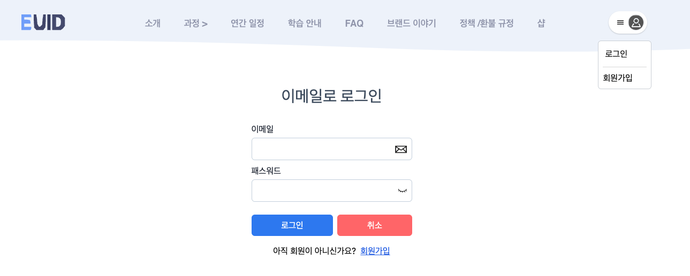
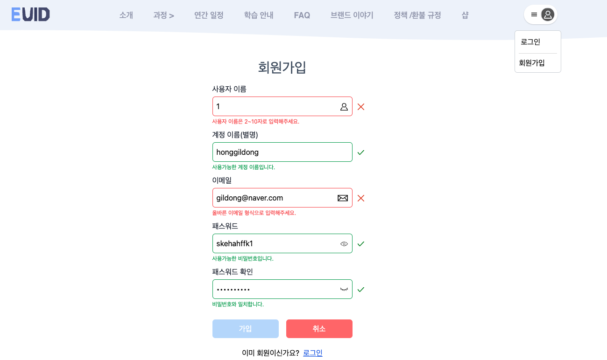
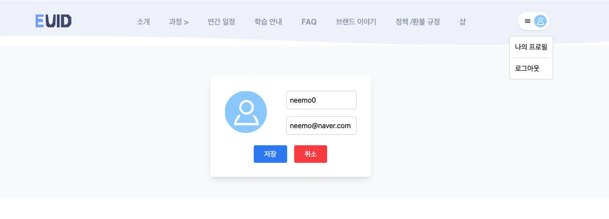

# 3주차 React 과제 - 이듬 블렌디드 러닝 사이트 (일부 구현)

[이듬 블렌디드 러닝](https://euid.dev/#/)을 구현해보고자 했습니다.
2주차 과제에서 추가된 부분 로그인 / 회원가입 / 프로필 페이지가 추가되었습니다.

[배포 사이트](https://juniortunarr.github.io/blendedEuid)

## 결과(구현화면)

### 로그인



### 회원가입



### 프로필 변경



## 파일 구조

src

```js

src
├── App.jsx
├── api
│   └── pocketbase.js
├── components
│   ├── Common
│   │   ├── Spinner.jsx
│   │   ├── SubTitleWrapper.jsx
│   │   └── TitleWrapper.jsx
│   ├── Footer
│   │   ├── FooterAbout.jsx
│   │   ├── FooterCopyright.jsx
│   │   ├── FooterIllust.jsx
│   │   └── FooterInfo.jsx
│   ├── Header
│   │   ├── GlobalNavigationBar.jsx
│   │   ├── HeaderHeading.jsx
│   │   └── UserSection.jsx
│   └── Home
│       ├── Contents
│       │   ├── CourseCategory.jsx
│       │   ├── CourseItems.jsx
│       │   ├── LectureHall.jsx
│       │   ├── OpeningDay.jsx
│       │   ├── Review.jsx
│       │   ├── ReviewItems.jsx
│       │   ├── ShowCase.jsx
│       │   └── ShowItems.jsx
│       ├── HomeContents.jsx
│       └── HomeHeading.jsx
├── contexts
│   └── Auth.jsx
├── hooks
│   ├── useFetchdata.js
│   ├── useFormdata.js
│   └── useStorage.js
├── layout
│   ├── FooterBar.jsx
│   ├── HeaderBar.jsx
│   └── RootLayout.jsx
├── main.jsx
├── pages
│   ├── About.jsx
│   ├── Course.jsx
│   ├── Faq.jsx
│   ├── Guide.jsx
│   ├── Home.jsx
│   ├── PrivacyPolicy.jsx
│   ├── Profile.jsx
│   ├── Schedule.jsx
│   ├── Shop.jsx
│   ├── SignIn.jsx
│   ├── SignUp.jsx
│   └── Story.jsx
├── routes.jsx
├── styles
│   └── tailwind.css
└── utils
    ├── debounce.js
    └── getUserPbImageUrl.js
```

components

```js
src/components
├── Common
│   ├── Spinner.jsx
│   ├── SubTitleWrapper.jsx
│   └── TitleWrapper.jsx
├── Footer
│   ├── FooterAbout.jsx
│   ├── FooterCopyright.jsx
│   ├── FooterIllust.jsx
│   └── FooterInfo.jsx
├── Header
│   ├── GlobalNavigationBar.jsx
│   ├── HeaderHeading.jsx
│   └── UserSection.jsx
└── Home
    ├── Contents
    │   ├── CourseCategory.jsx
    │   ├── CourseItems.jsx
    │   ├── LectureHall.jsx
    │   ├── OpeningDay.jsx
    │   ├── Review.jsx
    │   ├── ReviewItems.jsx
    │   ├── ShowCase.jsx
    │   └── ShowItems.jsx
    ├── HomeContents.jsx
    └── HomeHeading.jsx


```

## 회고

- 프로필 변경부분은 현재 username만 정상적으로 변경된다.
  (프로필 이미지 변경은 DB에 반영되나 다시 불러와 띄우는데 문제가 있는 상태고,
  이메일 변경의 경우, 포켓호스트 측에서 이메일 인증 요청이나 admin의 경우는 안된다고 한다. [내용 참고](https://github.com/pocketbase/pocketbase/discussions/2938))
- 배포 문제, 포켓베이스 활용 문제 등 많은 문제를 발견해서 해결한답시고 너무 많은 시간을 쏟아서 기능 구현을 전반적으로 못했지만 틈틈이 리팩토링하고 추가로 개발할 예정이다.
- 추후에 개선해볼 것
  - 다른 페이지들 완성
  - 애니메이션 구현(GSAP or Framer Motion)
  - 성능 개선(useMemo or useCallback)
  - SEO 개선(Helmet)
  - FAQ 문답 게시판 / 샵 기능 (CRUD)
  - 컴포넌트 세분화
